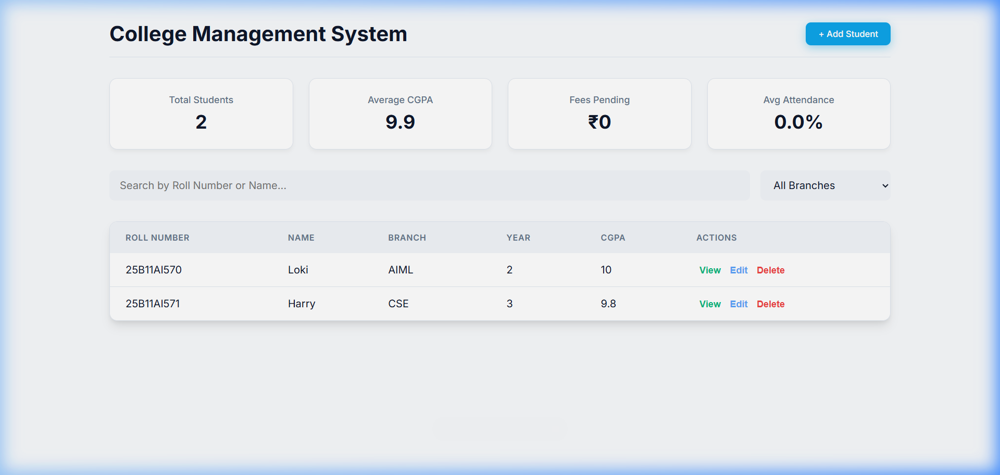
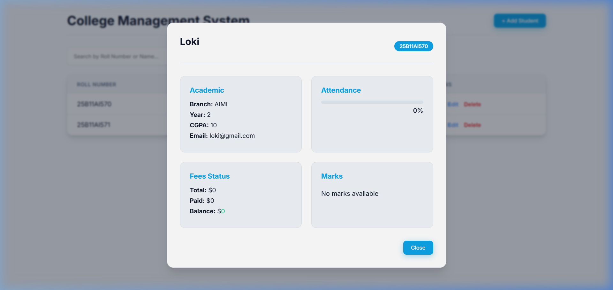
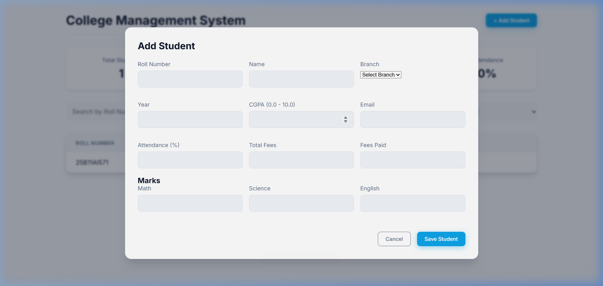

# College Management System

## Project Description
A full-stack web application designed for comprehensive college record management. Originally built as a simple CLI tool, this system has been fully migrated into a modern, dynamic web application with a beautiful Light Mode UI. It allows administrators to track student profiles, academic performance, fee statuses, and attendance seamlessly.

## Key Features
- **Student Profiles:** Add and manage detailed student profiles including Roll Number, Branch, Year, CGPA, and Email.
- **Academic Tracking:** Track specific subject marks (Math, Science, English) and view them in a dedicated profile view.
- **Fee Management:** Monitor total fees versus fees paid, and instantly view the outstanding balance for each student.
- **Attendance Monitoring:** Track attendance percentages with visual, color-coded progress bars.
- **Dynamic Web Interface:** A fast, responsive frontend built with Vanilla JS, HTML, and a minimalist CSS Light Mode aesthetic.
- **RESTful API Backend:** Powered by Flask (Python) to securely handle CRUD operations.
- **Data Persistence:** Lightweight, seamless data storage using a `students.json` database.

## Screenshots

### Main Dashboard


### Student Profile View


### Add Student Modal



## Technologies Used
- **Backend:** Python, Flask
- **Frontend:** HTML5, CSS3 (Light Mode UI), Vanilla JavaScript
- **Database:** JSON (File-based storage)

## How to Run

1. **Prerequisites:** Ensure you have Python installed.
2. **Setup Virtual Environment:**
   ```bash
   python -m venv venv
   # On Windows:
   .\venv\Scripts\activate
   # On Mac/Linux:
   source venv/bin/activate
   ```
3. **Install Dependencies:**
   ```bash
   pip install -r requirements.txt
   ```
4. **Run the Application:**
   ```bash
   python app.py
   ```
5. **Access the Web App:**
   Open your browser and navigate to `http://127.0.0.1:5000`

## Future Improvements
- **Database Migration:** Upgrade data layer from JSON to SQLite or PostgreSQL for enterprise scalability.
- **Authentication:** Add login portal for admins and individual dashboard access for students.
- **Data Export:** Add ability to export report cards and fee receipts as PDF.
